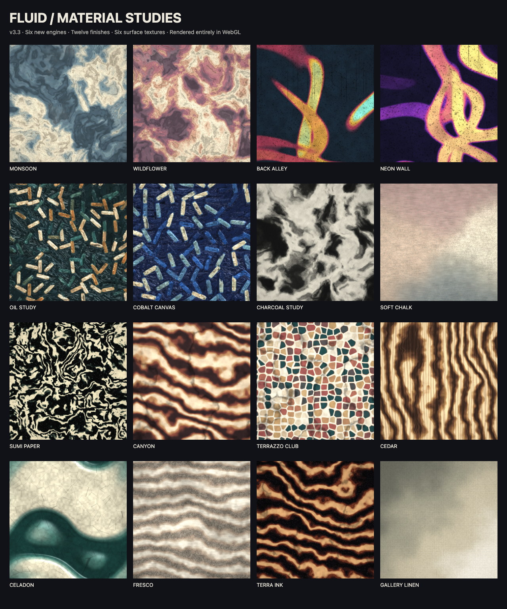

<div align="center">


# Fluid

Dependency-free WebGL studio for generating backgrounds, wallpapers, Open Graph
images, and live embeddable canvases.

One HTML file. No build step. No backend state. No runtime dependencies.

[](LICENSE)
&nbsp;[](https://befluid.xyz)
&nbsp;[](#quick-start)
&nbsp;[](https://www.npmjs.com/package/fluid-bg)
&nbsp;[](https://www.npmjs.com/package/fluid-core)

[Studio](https://befluid.xyz) ·
[Backgrounds](https://befluid.xyz/backgrounds) ·
[Gallery](https://befluid.xyz/gallery) ·
[Manual](https://befluid.xyz/manual) ·
[Dev/API](https://befluid.xyz/dev)

</div>

## v3.3 — Material Studio

Six new engines, six new finishes, six independent surface textures, and sixteen artist recipes.
Start with **MONSOON**, **BACK ALLEY**, **OIL STUDY**, or **CELADON** in the studio’s Look tab.



See the [material guide](docs/MATERIALS.md) for every option, API examples, and contribution notes.

## Features

- WebGL1 fragment-shader renderer with 30 field engines, including a quasicrystal, paper marbling, string-art caustics, whirling pursuit polygons, Chladni plate figures, Cassini ovals, topographic contours, and a von Karman vortex street.
- Kaleidoscope symmetry modifier: fold any field into an N-fold radial mandala.
- Layers: stack up to three engines, each blending onto everything under it with multiply / screen / add / difference / overlay.
- Math lenses: bend the plane through 12 conformal maps — z², 1/z, Möbius, Droste, hyperbolic, Julia, z³, e^z, sin z, Joukowski, Newton basins, and the SL(2,ℤ) modular fold — plus Ground, which is a camera rather than a map: it tips the plane away so any engine recedes to a horizon.
- Twelve finishes: glass, metal, sand, liquid, molten, oil paint, watercolor, graffiti, charcoal, pastel, ink, and ceramic.
- Six independent substrates: canvas, paper, concrete, stone, wood, plaster. Adjust finish strength, texture size, relief, and surface strength; combine any finish with any substrate.
- Six new engines: wash, spray, brushwork, strata, terrazzo, and woodgrain. Sixteen complete artist recipes, plus the existing forty-two looks.
- Square, hex, ASCII, halftone, ordered-dither, and glitch surface modes.
- Preset palettes plus shareable custom four-stop gradients, with a draggable colour editor: saturation/brightness pad, hue strip, HSB and RGB sliders, hex, and harmony schemes that rebuild the whole ramp from one hue.
- Optional image melt: uploaded image luminance drives the field.
- Text in living colour: fill a word or brand name with the field, with a 9-font picker and a background-colour choice; persists locally and travels in share links.
- Exact-size export as PNG, JPG, or WebP.
- Self-contained HTML export: copy the piece as a complete, dependency-free file with the shaders inlined — no iframe, no server.
- Clip recording through `MediaRecorder`.
- Undo across the session, with a Recent shelf of every state you passed through as thumbnails.
- Explore: a fresh shelf of generated pieces on every open, rendered on the spot — plus a seed of the day, one piece per UTC day, the same for everyone.
- URL hash format that round-trips every piece without server storage.
- Cloudflare Worker API and Streamable HTTP MCP endpoint.

## Examples

<p align="center">
<a href="https://befluid.xyz/#p=0.5,1.5,5.5,0.03,1,10,0,0,18,0,0,1.7778,0,0,1" title="Aurora Flow"></a>
<a href="https://befluid.xyz/#p=0.5,1.4,6,0.03,1,10,0,6,52,0,0,1.7778,0,0,5" title="Pulse"></a>
<a href="https://befluid.xyz/#p=0.4,1.5,5,0.03,1,10,0,1,33,0,0,1.7778,0,0,6" title="Bloom"></a>
<a href="https://befluid.xyz/#p=0.4,1.9,8,0.03,1,10,0,4,60,0,0,1.7778,0,0,2" title="Magma Cells"></a>
<a href="https://befluid.xyz/#p=0.4,1.6,4.5,0.03,1,10,0,0,28,0,0,1.7778,0,0,3" title="Ribbon"></a>
<a href="https://befluid.xyz/#p=0.4,1.8,3.5,0.03,1,10,0,4,44,0,0,1.7778,0,0,4" title="Wiring"></a>
</p>

Each thumbnail opens the live piece in the studio.

## Quick Start

```sh
git clone https://github.com/enonforetsam/fluid
cd fluid
open index.html
```

For the Worker routes, security headers, JSON API, and MCP endpoint:

```sh
npm run dev            # http://localhost:8787
```

Use the script rather than a bare `npx wrangler dev`. The assets directory is the repo root,
so wrangler's own `.wrangler/state` writes land inside the tree it is watching — it sees them,
reloads, writes again, and reloads about once every four seconds forever, which makes requests
hang mid-reload. The script keeps that state outside the repo with `--persist-to`.

## Embed

Want a calm background rather than a piece? [befluid.xyz/backgrounds](https://befluid.xyz/backgrounds)
is a live landing page over the engine: pick one of ten ambient presets, set blur and dim,
copy the tag.

```html
<script src="https://befluid.xyz/fluid-bg.js"></script>
<fluid-bg fixed preset="mist" blur="24" dim="0.4"></fluid-bg>
```

`preset` names one of `mist ember dusk ink glow aurora deep paper lilac shore`; `blur` is px,
`dim` an overlay opacity (`dim-color="#fff"` on light pages). The script at `/fluid-bg.js` is
the current `fluid-bg` build, self-hosted so it never waits on npm.

The **v3.3.0 GitHub release** includes installable `fluid-core` and `fluid-bg` archives. The
npm registry may contain an older version; use these archives for the new material engine:

```sh
npm install https://github.com/enonforetsam/fluid/releases/download/v3.3.0/fluid-bg-3.3.0.tgz
# Raw engine, without the web component:
npm install https://github.com/enonforetsam/fluid/releases/download/v3.3.0/fluid-core-3.3.0.tgz
```

React: `import FluidBg from 'fluid-bg/react'`. Keep the page background transparent when using
`fixed` — see [fluid-bg/README.md](fluid-bg/README.md).

The zero-dependency [fluid-core library](fluid-core/README.md) gives direct control:

```js
import { createFluid } from 'fluid-core';
const art = createFluid(document.querySelector('#art'), {
  look: 'MONSOON', substrate: 'canvas', textureScale: 1.4, relief: 0.8
});
art.set({ material: 'ink', materialAmt: 0.65 });
```

No npm at all? A plain iframe still works:

```html
<iframe
  src="https://befluid.xyz/#p=0.5,1.5,5.5,0.03,1,10,0,0,18,0,0,1.7778,0,1,1"
  title="Fluid background"
  loading="lazy"
  style="border:0;width:100%;height:100%">
</iframe>
```

The embed flag makes the canvas fill the iframe without the studio UI.

## What is open, what is hosted

Everything in this release is MIT: the studio, engines, materials, native library, background
component, API, and MCP server. The studio runs locally without accounts or a backend.
The hosted publishing/community experiment lives separately from this engine release.

The share-hash contract (the `#p=` fields, append-only) is the project's real API and is
specified in [docs/ARCHITECTURE.md](docs/ARCHITECTURE.md#share-hash-contract).

## API

```sh
curl "https://befluid.xyz/api/piece?look=monsoon&substrate=canvas&relief=0.8"
curl "https://befluid.xyz/api/piece?field=flow&palette=sunset&warp=4"
curl "https://befluid.xyz/api/piece?field=cellular&colors=0a0a1a,3a1f7a,c84fe0,ffe1f5"
curl "https://befluid.xyz/api/looks"
curl "https://befluid.xyz/api/today"            # the day's piece
curl "https://befluid.xyz/api/today?date=2026-01-01"   # replay any day
```

`/today` is a permalink that opens the day's piece in the studio.

MCP clients that support Streamable HTTP can connect to:

```sh
https://befluid.xyz/mcp
```

Claude Code:

```sh
claude mcp add --transport http fluid https://befluid.xyz/mcp
```

On claude.ai (web, desktop, or mobile): Settings → Connectors → Add custom
connector → paste the `/mcp` URL. No auth. Tools: `create_piece`,
`get_embed_code`, `list_looks`, `get_seed_of_the_day`, `decode_link`.

AI agents without MCP can read the whole integration surface from
[`/llms.txt`](https://befluid.xyz/llms.txt).

## Architecture

| File | Purpose |
|---|---|
| `index.html` | Complete studio app: UI, WebGL shader, state, export, recording, sharing |
| `worker.js` | Cloudflare Worker: static assets, security headers, API, MCP, OG image rotation |
| `gallery.html` | Curated examples and downloadable preview images |
| `manual.html` | User reference |
| `dev.html` | Embed, API, and MCP reference |
| `fluid-core/` | Zero-dependency native canvas library on npm — shader + engine/palette/look tables generated from `index.html` by `fluid-core/build.mjs`, plus a small mount runtime; see `fluid-core/README.md` |
| `fluid-bg/` | npm package: `<fluid-bg>` web component + React wrapper built on `fluid-core`; see `fluid-bg/README.md` |
| `fluid-vibe/` | Prototype: client-side semantic "describe a vibe" matcher (transformers.js); not yet wired into the studio |
| `assets/` | Favicon, gallery previews, Open Graph images, and README media |

Important invariants:

- Keep the app dependency-free: no bundler, framework, or install step.
- Keep the shader source as joined string arrays.
- Preserve the append-only `#p=` share-hash field order.
- Keep mirrored constants in `index.html` and `worker.js` in sync.
- After changing engines, finishes, substrates, palettes, or looks, run `node fluid-core/build.mjs`, then `npm run build --prefix fluid-bg` — the test suite fails on drift.
- Scale screen-space shader sizes by the render scale `k` used for export.

See [docs/ARCHITECTURE.md](docs/ARCHITECTURE.md) for the share-hash contract and Worker mirror notes.

## Deploy

The hosted instance auto-deploys from `master` via GitHub Actions. To deploy
your own:

```sh
npx wrangler deploy
```

Staging:

```sh
npx wrangler deploy --env staging
```

Deployment requires Cloudflare credentials with Worker deploy access.

## Contributing

See [CONTRIBUTING.md](CONTRIBUTING.md). The most useful contributions are field
engines, palette presets, gallery pieces, manual fixes, and bug reports with a
share link.

## License

MIT. See [LICENSE](LICENSE).
