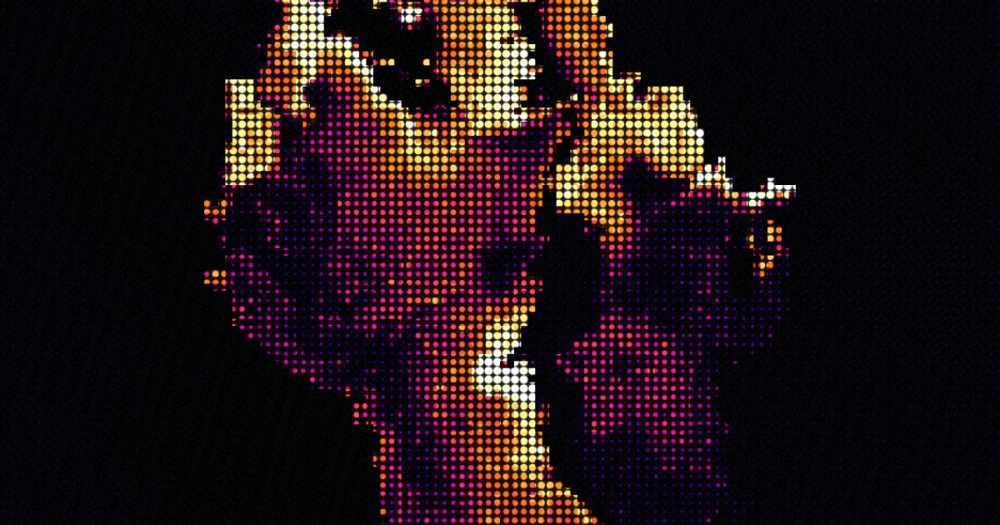
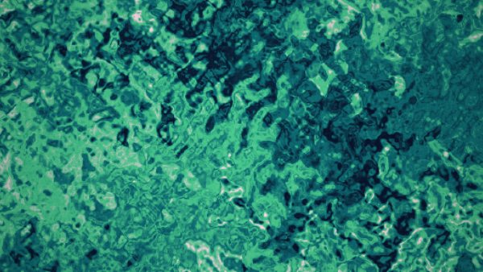
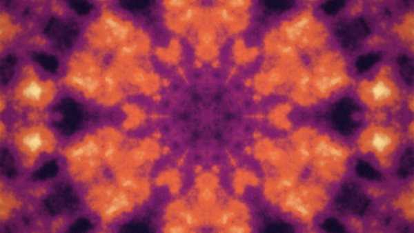
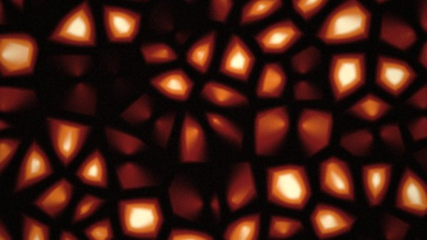

<div align="center">



# Fluid

Dependency-free WebGL studio for generating backgrounds, wallpapers, Open Graph
images, and live embeddable canvases.

One HTML file. No build step. No backend state. No runtime dependencies.

[](LICENSE)
&nbsp;[](https://fluid.krackeddevs.com)
&nbsp;[](#quick-start)
&nbsp;[](https://www.npmjs.com/package/fluid-bg)
&nbsp;[](https://www.npmjs.com/package/fluid-core)

[Studio](https://fluid.krackeddevs.com) ·
[Gallery](https://fluid.krackeddevs.com/gallery) ·
[Manual](https://fluid.krackeddevs.com/manual) ·
[Dev/API](https://fluid.krackeddevs.com/dev)

</div>

## Features

- WebGL1 fragment-shader renderer with 15 field engines, including a quasicrystal, a hexagonal honeycomb, a bloom mesh-gradient, and a corner-to-corner sweep.
- Kaleidoscope symmetry modifier: fold any field into an N-fold radial mandala.
- Layers: composite a second engine over the first with multiply / screen / add / difference / overlay blends.
- Material finishes: glass, metal, sand, liquid, and molten relighting.
- Square, hex, ASCII, halftone, ordered-dither, and glitch surface modes.
- Preset palettes plus shareable custom four-stop gradients.
- Optional image melt: uploaded image luminance drives the field.
- Text in living colour: fill a word or brand name with the field, with a 9-font picker and a background-colour choice; persists locally and travels in share links.
- Exact-size export as PNG, JPG, or WebP.
- Self-contained HTML export: copy the piece as a complete, dependency-free file with the shaders inlined — no iframe, no server.
- Clip recording through `MediaRecorder`.
- URL hash format that round-trips every piece without server storage.
- Cloudflare Worker API and Streamable HTTP MCP endpoint.

## Examples

<p align="center">
<a href="https://fluid.krackeddevs.com/#p=0.5,1.5,5.5,0.03,1,10,0,0,18,0,0,1.7778,0,0,1" title="Aurora Flow"></a>
<a href="https://fluid.krackeddevs.com/#p=0.5,1.4,6,0.03,1,10,0,6,52,0,0,1.7778,0,0,5" title="Pulse"></a>
<a href="https://fluid.krackeddevs.com/#p=0.4,1.5,5,0.03,1,10,0,1,33,0,0,1.7778,0,0,6" title="Bloom"></a>
<a href="https://fluid.krackeddevs.com/#p=0.4,1.9,8,0.03,1,10,0,4,60,0,0,1.7778,0,0,2" title="Magma Cells"></a>
<a href="https://fluid.krackeddevs.com/#p=0.4,1.6,4.5,0.03,1,10,0,0,28,0,0,1.7778,0,0,3" title="Ribbon"></a>
<a href="https://fluid.krackeddevs.com/#p=0.4,1.8,3.5,0.03,1,10,0,4,44,0,0,1.7778,0,0,4" title="Wiring"></a>
</p>

Each thumbnail opens the live piece in the studio.

## Quick Start

```sh
git clone https://github.com/enonforetsam/fluid
cd fluid
open index.html
```

For the Worker routes, security headers, JSON API, and MCP endpoint:

```sh
npx wrangler dev
```

## Embed

Two npm packages ship from this repo. [`fluid-bg`](https://www.npmjs.com/package/fluid-bg)
is the drop-in background — it renders natively on a canvas in your page (~15 KB gz, no iframe):

```html
<script src="https://cdn.jsdelivr.net/npm/fluid-bg@0.2"></script>
<fluid-bg fixed hash="#p=0.5,1.5,5.5,0.03,1,10,0,0,18,0,0,1.7778"></fluid-bg>
```

React: `npm i fluid-bg`, then `import FluidBg from 'fluid-bg/react'`. Keep the page
background transparent when using `fixed` — see `fluid-bg/README.md`.

[`fluid-core`](https://www.npmjs.com/package/fluid-core) is the raw engine library
underneath (`createFluid(el, {…})`, zero dependencies, TypeScript types) — see
`fluid-core/README.md`.

No npm at all? A plain iframe still works:

```html
<iframe
  src="https://fluid.krackeddevs.com/#p=0.5,1.5,5.5,0.03,1,10,0,0,18,0,0,1.7778,0,1,1"
  title="Fluid background"
  loading="lazy"
  style="border:0;width:100%;height:100%">
</iframe>
```

The embed flag makes the canvas fill the iframe without the studio UI.

## API

```sh
curl "https://fluid.krackeddevs.com/api/piece?look=borealis"
curl "https://fluid.krackeddevs.com/api/piece?field=flow&palette=sunset&warp=4"
curl "https://fluid.krackeddevs.com/api/piece?field=cellular&colors=0a0a1a,3a1f7a,c84fe0,ffe1f5"
curl "https://fluid.krackeddevs.com/api/looks"
```

MCP clients that support Streamable HTTP can connect to:

```sh
https://fluid.krackeddevs.com/mcp
```

Claude Code:

```sh
claude mcp add --transport http fluid https://fluid.krackeddevs.com/mcp
```

On claude.ai (web, desktop, or mobile): Settings → Connectors → Add custom
connector → paste the `/mcp` URL. No auth. Tools: `create_piece`,
`get_embed_code`, `list_looks`, `decode_link`.

AI agents without MCP can read the whole integration surface from
[`/llms.txt`](https://fluid.krackeddevs.com/llms.txt).

## Architecture

| File | Purpose |
|---|---|
| `index.html` | Complete studio app: UI, WebGL shader, state, export, recording, sharing |
| `worker.js` | Cloudflare Worker: static assets, security headers, API, MCP, OG image rotation |
| `gallery.html` | Curated examples and downloadable preview images |
| `manual.html` | User reference |
| `dev.html` | Embed, API, and MCP reference |
| `fluid-core/` | Zero-dependency native canvas library on npm — shader + engine/palette/look tables generated from `index.html` by `fluid-core/build.mjs`, plus a small mount runtime; see `fluid-core/README.md` |
| `fluid-bg/` | npm package: `<fluid-bg>` web component + React wrapper built on `fluid-core`; see `fluid-bg/README.md` |
| `fluid-vibe/` | Prototype: client-side semantic "describe a vibe" matcher (transformers.js); not yet wired into the studio |
| `assets/` | Favicon, gallery previews, Open Graph images, and README media |

Important invariants:

- Keep the app dependency-free: no bundler, framework, or install step.
- Keep the shader source as joined string arrays.
- Preserve the append-only `#p=` share-hash field order.
- Keep mirrored constants in `index.html` and `worker.js` in sync.
- After changing engines, palettes, or looks, run `node fluid-core/build.mjs` — the test suite fails on drift.
- Scale screen-space shader sizes by the render scale `k` used for export.

See [docs/ARCHITECTURE.md](docs/ARCHITECTURE.md) for the share-hash contract and Worker mirror notes.

## Deploy

The hosted instance auto-deploys from `master` via GitHub Actions. To deploy
your own:

```sh
npx wrangler deploy
```

Staging:

```sh
npx wrangler deploy --env staging
```

Deployment requires Cloudflare credentials with Worker deploy access.

## Contributing

See [CONTRIBUTING.md](CONTRIBUTING.md). The most useful contributions are field
engines, palette presets, gallery pieces, manual fixes, and bug reports with a
share link.

## License

MIT. See [LICENSE](LICENSE).
